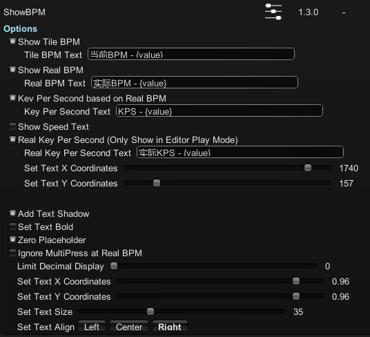

# ShowBPM
### 基于[ADOFAI_ShowBPM](https://github.com/FLOWERs-Modding/ADOFAI_ShowBPM)修改
## ShowBPM是什么？
 - ShowBPM是一个在游戏ADOFAI中显示BPM的mod  

## 有哪些功能？
- 轨道BPM
- 实际BPM
- 轨道每秒按键次数
- 真实的每秒按键次数  

## 如何下载？
 - [这里](https://github.com/StArrayJaN/ShowBPM/releases)可以下载最新版本